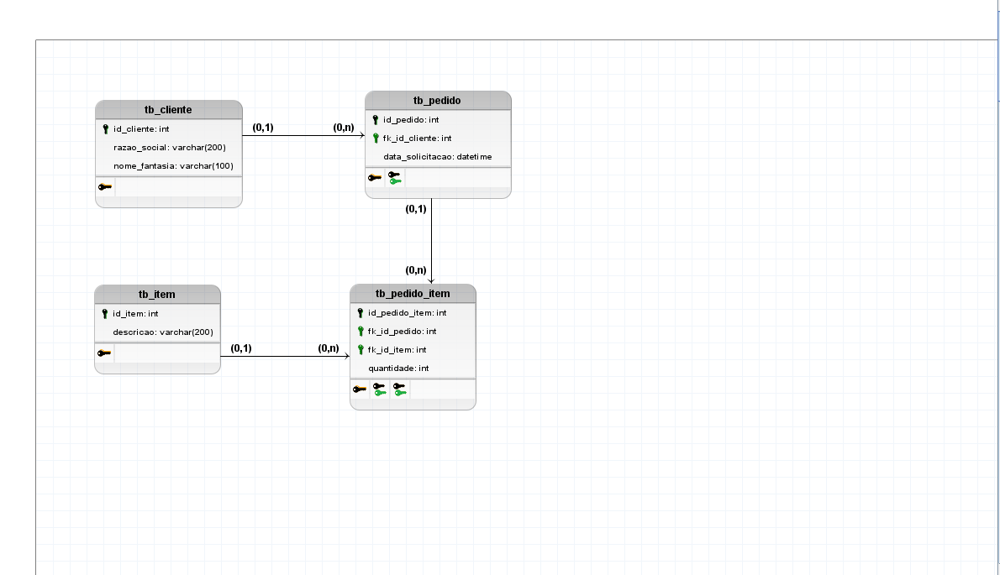

# ERPX Database

Projeto de banco de dados SQL Server para controle de pedidos.

## 📌 Funcionalidades
- Cadastro de clientes
- Cadastro de produtos
- Controle de pedidos
- Itens de pedidos
- View de pedidos detalhados
- Trigger de auditoria

## 🛠 Tecnologias
- SQL Server
- BRModelo

## ▶️ Como executar
Execute os scripts na ordem:

1. 01_create_database.sql  
2. 02_tables.sql  
3. 03_constraints.sql  
4. 04_inserts.sql  
5. 05_views.sql  
6. 06_extras.sql  
7. 07_triggers.sql  
8. 08_tests.sql  

---

## 📊 Modelagem do Banco

### 🔗 Acessar imagem do modelo

---

## 📁 Estrutura do Projeto

- tb_cliente  
- tb_item  
- tb_pedido  
- tb_pedido_item  
- tb_ordem_producao  

---

## 👨‍💻 Autor
Projeto desenvolvido para estudos de banco de dados.
